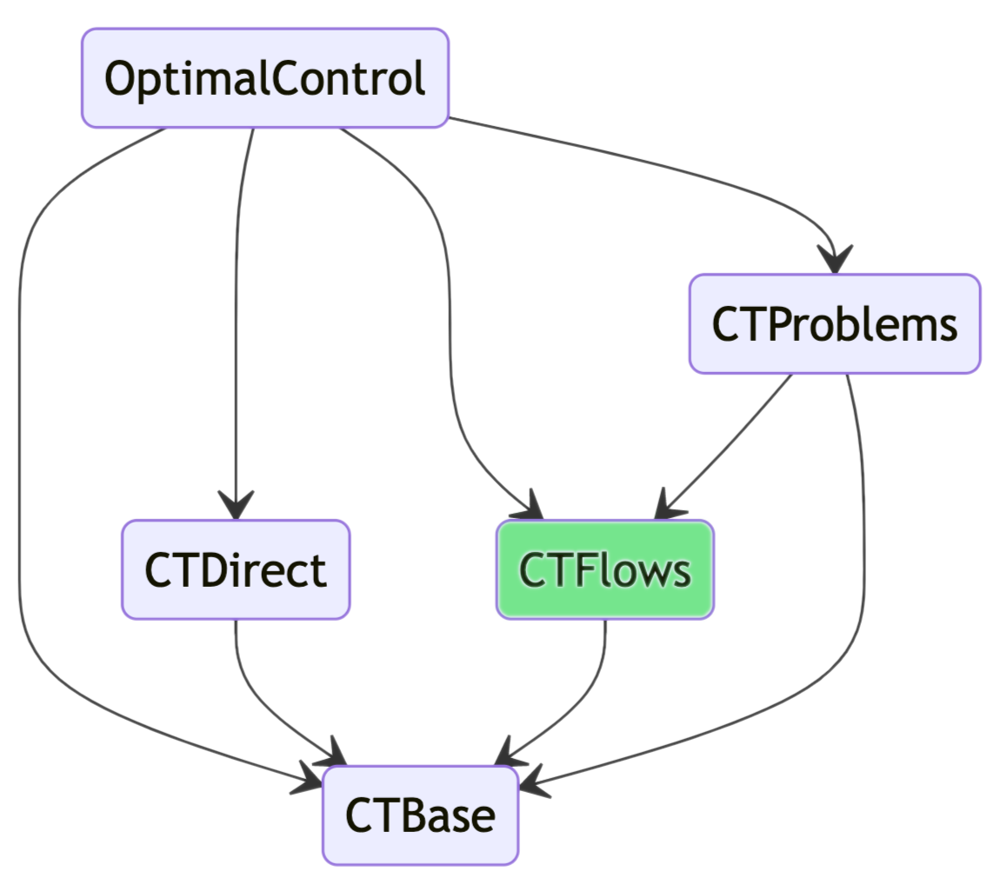

# CTFlows.jl

```@meta
CurrentModule =  CTFlows
```

The `CTFlows.jl` package is part of the [control-toolbox ecosystem](https://github.com/control-toolbox).

```@raw html

```

!!! note "Install"

    To install a package from the control-toolbox ecosystem, 
    please visit the [installation page](https://github.com/control-toolbox#installation).

It aims to provide tools to solve [mathematical flows](https://en.wikipedia.org/w/index.php?title=Flow_(mathematics)&oldid=1147546136#Flows_of_vector_fields_on_manifolds) of vector fields, and in particular [Hamiltonian vector fields](https://en.wikipedia.org/w/index.php?title=Hamiltonian_vector_field&oldid=1065470192) directly from the definition of the Hamiltonian, using automatic differentiation to construct the assiocated Hamiltonian vector field.

The flow is then computed thanks to [DifferentialEquations.jl](https://docs.sciml.ai/DiffEqDocs/stable/) package.